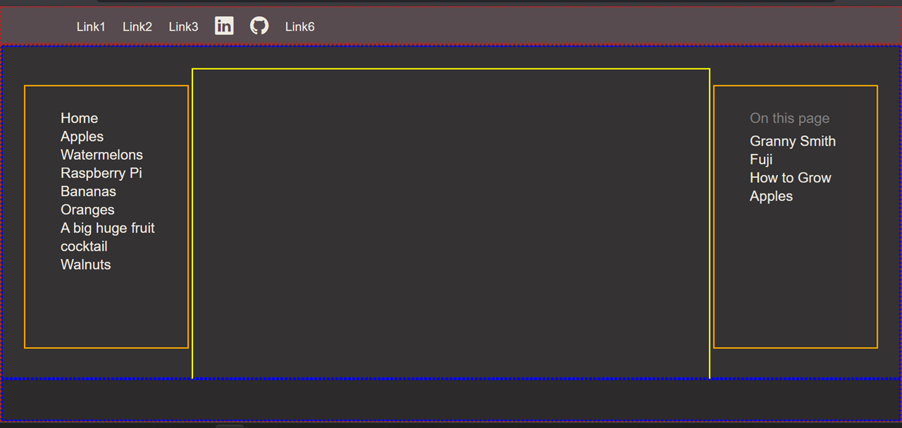
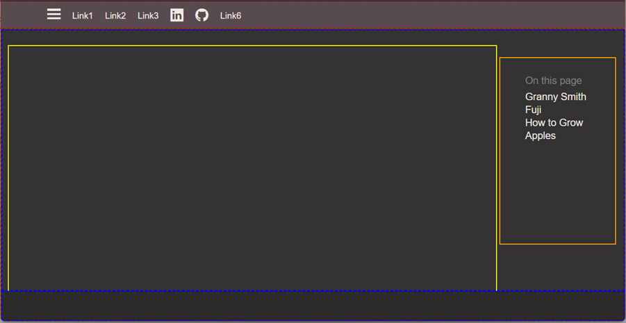
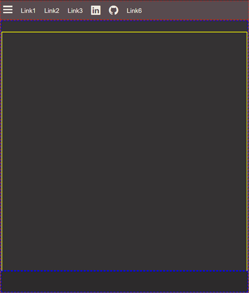

# Ethereal to Make Docs

A very light framework for building a static website or individual webpages that results in pages about as lightweight as they can be, having only the functionality you desire. 

Uses [`python-markdown`](https://python-markdown.github.io/) to render one or more Markdown files to HTML.  If multiple source files are rendered, a site is created with an equivalent file structure.  Works similar to [MkDocs](https://www.mkdocs.org/); HTML/CSS layout was derived from [Material for MkDocs](https://squidfunk.github.io/mkdocs-material/).  

The python script is small, and has much less functionality than MkDocs.  The HTML/CSS framework is small, and has much less functionality than Material.  The entire project is so tiny it's almost ethereal. 

The beneficial tradeoff of its diminutive size is flexibility.  It's in between starting from scratch and using a full-fledged framework like Material, but much closer to the former. Also note that much of the functionality of MkDocs & Material can be derived directly from functionality available in the python-markdown package if you wish to add it  manually.

If you need to build a website, or even a single webpage without having to add all the functionality yourself, then check out the excellent MkDocs & Material for MkDocs. If you want to make a few lightweight webpages similar in layout and responsiveness to Material, or if you want to make a substantial website and are willing to add features as necessary, then Ethereal to Make Docs might be a good starting point for you. 

 

## Features

* Python-markdown renderer: page's source written in markdown
* Responsive design
* Primary & secondary tables of contents
* Python script automatically creates the secondary table of contents
* Scrollspy
* View/edit source buttons
* Theme button to toggle between light, dark, and default themes
* Easily customizable with direct HTML/CSS coding.

# Demo site

Example of a live site using this package: [HyLown.com](https://hylown.com/)

## Responsive screenshots

### Fullsize



### Tablet



### Phone




# Python -- How to use Ethereal to Make Docs

Run `python/main.py` on Windows or Linux.  Tested on Windows 11 and Linux Debian bookworm; have not tested on MacOS.  

```
$ cd /path/to/project-root
$ python main.py
```

Or hit the run button in VScode.

### File structure

Here's the file structure to use:

* `project-root/`
    * `python/`
    * `site/`
        * `assets/`
    * `source/`

`project-root` is the name of your project.  `python/` houses `main.py`.  `site/` is created by `main.py` if it doesn't already exist.  `main.py` does not create the directory `assets/`; it is optional and you place it there with your CSS, Javascript, and other files.  `source/` contains all the Markdown source files of all your site's webpages.  

Example file structure for a site that has two "Books" (distinct areas of the website).  "Book 2" is just a single page.  "Book 1" has three "Chapters"; "Chapters" 1 & 3 are each only a single page, "Chapter 2" has a homepage and two additional pages.  

* `project-root/`
    * .gitignore
    * LICENSE
    * README.md
    * `python/`
        * main.py
    * `site/`
        * `assets/`
            * `css/`
                * colors_dark.css
                * colors_default.css
                * colors_light.css
                * ethereal.css
                * ethereal_home.css
            * `javascript/`
                * ethereal.js
        * `book1/`
            * `chapter2/`
                * index.html
                * page1.html
                * page2.html
            * `chapter3/`
                * index.html
            * index.html
        * `book2/`
            * index.html
        * index.html 
    * `source/`
        * `book1/`          
            * `chapter2/`   
                * index.md  
                * page1.md  
                * page2.md  
            * book1.html    
            * chapter3.md   
            * index.md      
        * `book2/`
            * book2.html
            * index.md      
        * ethereal.html     
        * index.md          

All the HTML files under `source/` are templates; all the HTML files under `site/` are those created by `main.py` using `python-markdown`.  Each directory's homepage should be named `index.md`.  


### `python/main.py`

Uses `python-markdown` to render your Markdown files under `source/` to HTML files under `site/`.  It creates the correct directory structure under `site/` if it doesn't already exist, including the directory `site/` itself.  It does not create the `assets/` directory; this is where you customize by placing CSS, Javascript, and other files.

Since it uses `python-markdown` you should be able to use all the features of that package (only the ones used here have been tested).  

Your Markdown source files can have a YAML header to pass the following information to the python code:  

* Optional  
    * `page_type`: If it has the case-insensitive value `homepage`, then `main.py` returns the HTML template; useful for website homepage.
    * `title`: string passed to HTML template; use it for the `<title>` element in the `<head>`.
    * `id_to_make_active`: HTML ID of the left TOC element for the page
    * `source`: Boolean to determine whether to add the URL for the Markdown source on GitHub.
* Required if `page_type` is missing or is present and equals anything other than `homepage`
    * `html_template`: location from `project-root/` to the HTML template.


`main.py` uses the python format method to pass 6 values to the HTML template:

```python
return html_template.format(
    title    = tit, 
    toc      = pagetoc, 
    body     = mdbody, 
    activate = active, 
    source   = github_source,
    root     = rootbk
    )
```

The values of `tit` and `active` come directly from `title` and `id_to_make_active` YAML values, resp. The value of `pagetoc` is generated automaticaly from the H2 Headings.  The value of `mdbody` is everything in your Markdown source file below the YAML header.  The value of `github_source` will be created if the YAML value `source` is `true`.  

The value of `rootbk` is automatically generated, and represents the path back to `project-root` from the directory housing the current Markdown source file, e.g. we might have that `rootbk = "../../"`.  

In your HTML template write links using `{-root-}` **without the dashes**, e.g.

```
href="{-root-}assets/css/ethereal.css" <!-- Remove the dashes around -root-! -->
```

Can also be used in the Markdown source **without the dashes**, e.g.

```
{: width=700 height=466}

** Remove the dashes around -root-! **
```

Packages used:  

* markdown
* os
* sys
* pathlib
* frontmatter
* re

### `.gitignore`

The `.gitignore` file has:

```
site/*
!site/assets/
!site/assets/**  
```

You don't want to copy your generated website, only the underlying code.  This .gitignore ignores everything in `site/` except  `assets/` and its contents.


# HTML/CSS Structure

Responsive breakpoints are 

**phone** | `768px` | **tablet** | `1024px` | **laptop**

* Under 1024px Hamburger menu icon appears, left TOC hidden & moved to menu
* Under 768px right TOC hidden; current version of this template does not place it in menu


## Outline

- html
- head
- body -- ``flex, column``
  - header
  - .container -- ``flex, column``
    - main
      - .main__inner .md-grid ``flex, row``
        - .sidebar .sidebar--primary
          - .sidebar__scrollwrap
            - .sidebar__inner
        - .sidebar .sidebar--secondary
          - .sidebar__scrollwrap
            - .sidebar__inner
        - .content
    - .footer

## Layout

- html
  - display      = block
  - height       = 100%
  - box-sizing   = border-box
  - overflow-x   = hidden


- body
  - display          = flex
  - flex-direction   = column
  - position         = relative
  - box-sizing       = border-box
  - margin-bottom    = 0px
  - margin-left      = 0px
  - margin-right     = 0px
  - margin-top       = 0px
  - min-height       = 100%
  - width            = 100%

- header
  - display      = block
  - box-sizing   = border-box
  - left         = 0px
  - right        = 0px
  - top          = 0px
  - ~~position   = sticky~~
  - ~~z-index    = 4~~

- .container
  - display          = flex
  - flex-direction   = column
  - flex-grow        = 1
  - box-sizing       = border-box

- main
  - display      = block
  - flex-grow    = 1
  - box-sizing   = border-box

- .main__inner .grid
  - display          = flex
  - height           = 100%
  - margin-left      = 0px
  - margin-right     = 0px
  - margin-top       = 1.5rem
  - max-width        = 1220px
  - box-sizing       = border-box

- .sidebar .sidebar--primary
  - display          = block
  - align-self       = flex-start
  - flex-shrink      = 0
  - position         = sticky
  - height           = 100%
  - width            = 12.1rem
  - left             = -12.1rem
  - top              = 48px
  - padding-bottom   = 1.2rem
  - padding-left     = 0px
  - padding-right    = 0px
  - padding-top      = 1.2rem
  - box-sizing       = border-box
  - ~~z-index          = 5~~

- .sidebar__scrollwrap
  - display          = block
  - height           = 2239px
  - margin-bottom    = 0px
  - margin-left      = 4px
  - margin-right     = 4px
  - margin-top       = 0px
  - overflow-y       = auto
  - box-sizing       = border-box

- .sidebar__inner
  - display          = block
  - padding-right    = 4px
  - box-sizing       = border-box

- .sidebar .sidebar--secondary
  - same as .sidebar .sidebar--primary, except:
  - order = 2

- .content
  - display      = block
  - flex-grow    = 1
  - min-width    = 0px
  - box-sizing   = border-box


- .footer
  - display      = block
  - box-sizing   = border-box